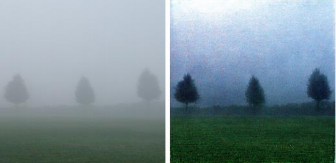

# Capstone_fog_vision
The major objective of our project is to clear the haze from the visuals and make the visuals clear. Moreover, we will be doing visibility enhancement of the degraded visuals by the foggy weather condition using Deep Neural Network.

# Objective
The major objective of our project is to clear the haze from the visuals and make the visuals clear. Moreover, we will be doing visibility enhancement of the degraded visuals by the foggy weather condition using Deep Neural Network.
Description
In the todays world safety and security is the major concern for all of us. There is always risk with vehicles we use today that is not just because of the vehicles but also due to the surrounding environment. Keeping all these things in the mind there are many technologies driven camera-based advanced driver assistance systems (ADAS) have been introduced. Now, one of the problems that drivers face today is of lower visibility and lower clear vision while driving vehicles in the foggy weather. Through our project we are going to present an approach to provide the solution to this problem by the help of deep neural network. In our project we have considered fog in a visual is nothing but noise and can be mathematically expressed by the help of some unknown complex function and we will utilize the deep neural network identify that function and minimize/approximate the effect of fog in the visual. 
The advantages of the technique we are using are:
1) It’s a real-time operation
2) Minimal input is required
We’ll be going to use the Generative Adversarial Networks (GANs) one of best deep neural network architecture. GAN is not just capable of doing things which we want it to do but along side it does many things inside it while computation.

# Scope
Through the above description this project seems to be like limited to the fog, but the reality is, it’s wide. In the today’s world air pollution is also one of the major problems we are facing which is again causing the unclear visual. This project is the foundation of the solution of all the other problem we are facing or could face in the future. 
This project can be even used to make devices through which user would be able to see the clear visuals even if there is very less real visibility.
A lot of research is going on in this field of computer vision and there are different techniques are coming up every moment. 

# System Description

Functional Requirements:
Image processing layer for improving image gradients
Streaming frames of images in chunks
Cloud processing of images with GAN model
GAN model and dependencies
Storing trained Models and caching when needed
Single layer for static image filtering
Data preprocessing pipeline
Featurization pipeline
Mobile application API framework

# Non-functional Requirements:
1. Cloud processing latency must be minimized
2. Must be compatible with mainstream hardware
3. Must have a quick installation package
4. Must have a simple input and output framework
5. Simplistic UI/UX
6. Simplistic level of abstraction
7. Easy troubleshooting

# Dependencies:
1. A VGG-19 pretrained on the ImageNet dataset.
2. NYU Depth Dataset V2 and the Make 3D dataset for training.
3. Google Vision API’s.
       

# Toolset Requirements:
1. TensorFlow (version 1.4+)
2. Matplotlib
3. Numpy
4. Scikit-Image

# DESIGN

Cause of haze at pixel and technical level
Number of suspended particles are high in foggy weather.
The camera takes in the light reflected by the environment.
During winters the particles suspended in the light scatter light and thus degrade image quality.
These particles will then generate gray hue in the image.
Theoretically formulation of the hazy model can be given by     

I(x) is the pixel characteristics for my image where x is the pixel number
J(x) is the light reflected from the surface also t(x) is the transmission map
J(X)t(x) is the direct attenuation or the direct transmission of scene. In other words, it corresponds to the reflected light of the surfaces in the scene and reaches the camera directly without being scattered.
A[1−t(x)] expresses the real colour cast of the scene due to the scattering of atmospheric light. 
t denotes the amount of light transmission between the observer and the surface.

β is the medium attenuation coefficient
d represents the distance between the observer and the considered surface

Now, we only need to find the transmission map and we can generate the fog-less image by the following equation

Now most of the researchers follows manual methods to calculate the transmission map, which is inefficient but, in this project we will use three modules of U-Net encoder-decoder structures which are as follows:

1. Condition GAN: Which will predict or estimate the transmission map
2. U-net: Which will find the haze feature automatically for us which was a pain in statistical machine learning.
Both will form a collaborative feature GAN's are highly effective end to end models.

# The model has the following components:
The 56-Layer Tiramisu as the generator.
A patch-wise discriminator.
A weighted loss function involving three components, namely:
GAN loss component.
Perceptual loss component (aka VGG loss component).
L1 loss component

# Tech-stack
TensorFlow (version 1.4+)
Matplotlib
Numpy
Scikit-Image

# Dependencies
We used the NYU Depth Dataset V2 and the Make 3D dataset for training.

